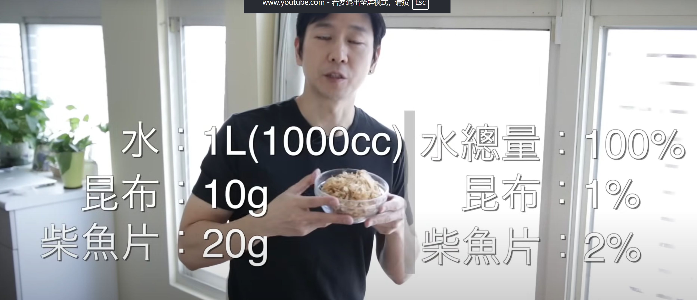

# 菜谱

## 辣椒油

<https://www.youtube.com/watch?v=qAA8jA5Nu3M>
<https://www.youtube.com/watch?v=liyy9eb2xb0>

油泼辣子配方：

- 辣椒粉（带籽）：30克，1/3 杯
- 辣椒粉：35克，1/3 杯
- 五香粉：2克，1/2 小勺
- 生姜粉：2克，1/2 小勺
- 芝麻：10克，1 大勺
- 香醋：15克，1 大勺
- 油：440克，2 杯

Chili oil ingredients:

- Chili powder with seeds: 30 g, 1/3 cup
- Chili powder: 35 g, 1/3 cup
- 5-spice powder: 2 g, 1/2 teaspoon
- Ginger powder: 2 g, 1/2 teaspoon
- Sesame: 10 g, 1 tablespoon
- Chinkiang vinegar: 15g, 1 tablespoon
- Oil: 440 g, 2 cups

用两倍辣椒

油温烧到220摄氏度关火，十分钟之后是180摄氏度。下芝麻。炸一分钟。这时油温降低到170，开始下香料。150度的时候泼醋。醋冒白气之后温度降低到120度。放凉就好了。

## 日式高汤

[ 材料 - Ingredients ]

- 干昆布 Dried kelp ( Konbu ) - 10gm
- 柴鱼片 Dried Bonito flakes ( Katsuo Bushi ) - 20gm
- 白芝麻 White sesame - 2 小匙

[ 调味料 - Seasonings ]

- 水 Water - 1 liter ( 1000cc )
- 麻油 Sesame oil - 少许
- 清酒 Sake - 1 大匙
- 味淋 Mirin - 1/2 大匙
- 酱油 Soy sauce - 1 大匙

[ 做法 - Method ]

1. 把昆布放入裝水好的锅子，泡至少 30 分钟。
＊放一个晚上也可以
2. 开中小火煮大概 10 分钟后转大火让它 (煮) 滾。
3. 开始滾后熄火把昆布拿出來。
＊昆布不要一直留在滾水里面，它会出杂·汁 & 黏液。
4. 放入柴鱼片开中火，让它 (煮) 滾，继续煮 1~2 分钟后熄火。
＊如果表面出來泡泡的话，可以捞出來。
5. 熄火后等到柴鱼片全部沉淀。
6. 用网子 (筛网)、纸巾或纱布过滤汤。
＊冷卻后可以放入冷藏或冷冻起來。
7. 平底锅开中火，加入一点麻油。放入熬汤用 (过) 的柴鱼片，炒到稍微干燥一点。
8. 放入切丝的昆布，搅拌让昆布平均散开。
9. 加入清酒、味淋、酱油 & 白芝麻混合好后熄火。
＊配白饭很适合，裝在便当盒也很好 ～！

## 饼

500g 中筋面粉

5g盐 1tsp

320g 50-60 摄氏度温水

揉成面团

分成三份

稍微搓成长条

在盘子上喷油

面放上面再喷油

盖起来 醒面一个小时

锅中火预热 中小火煎饼

## 🐖picnic假装是猪蹄

焯水40分钟

刷白醋

烤箱180摄氏度 356华氏度 一个小时

broil on high 10 min

然后切块 炖三小时
